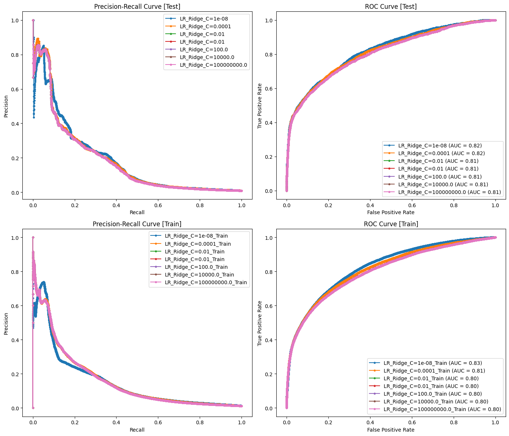

```python
import pandas as pd
import numpy as np
from sklearn.linear_model import LogisticRegression
from sklearn.pipeline import Pipeline
from sklearn.preprocessing import StandardScaler, OneHotEncoder
from sklearn.compose import ColumnTransformer
from sklearn.metrics import precision_recall_curve, roc_curve, auc
import matplotlib.pyplot as plt
```


```python
final_train_cols
```


    ['ordered_before',
     'abandoned_before',
     'avg_days_to_buy_variant_id',
     'global_popularity',
     'normalised_price']


```python
# Cargamos los datos del modelo
DATA_PATH = 'files/feature_frame.csv'
ORDERS_PATH = 'files/orders.parquet'
df_base = pd.read_csv(DATA_PATH)
```

### Información básica


```python
df_base.head(3)
```


<div>
<style scoped>
    .dataframe tbody tr th:only-of-type {
        vertical-align: middle;
    }

    .dataframe tbody tr th {
        vertical-align: top;
    }

    .dataframe thead th {
        text-align: right;
    }
</style>
<table border="1" class="dataframe">
  <thead>
    <tr style="text-align: right;">
      <th></th>
      <th>variant_id</th>
      <th>product_type</th>
      <th>order_id</th>
      <th>user_id</th>
      <th>created_at</th>
      <th>order_date</th>
      <th>user_order_seq</th>
      <th>outcome</th>
      <th>ordered_before</th>
      <th>abandoned_before</th>
      <th>...</th>
      <th>count_children</th>
      <th>count_babies</th>
      <th>count_pets</th>
      <th>people_ex_baby</th>
      <th>days_since_purchase_variant_id</th>
      <th>avg_days_to_buy_variant_id</th>
      <th>std_days_to_buy_variant_id</th>
      <th>days_since_purchase_product_type</th>
      <th>avg_days_to_buy_product_type</th>
      <th>std_days_to_buy_product_type</th>
    </tr>
  </thead>
  <tbody>
    <tr>
      <th>0</th>
      <td>33826472919172</td>
      <td>ricepastapulses</td>
      <td>2807985930372</td>
      <td>3482464092292</td>
      <td>2020-10-05 16:46:19</td>
      <td>2020-10-05 00:00:00</td>
      <td>3</td>
      <td>0.0</td>
      <td>0.0</td>
      <td>0.0</td>
      <td>...</td>
      <td>0.0</td>
      <td>0.0</td>
      <td>0.0</td>
      <td>2.0</td>
      <td>33.0</td>
      <td>42.0</td>
      <td>31.134053</td>
      <td>30.0</td>
      <td>30.0</td>
      <td>24.27618</td>
    </tr>
    <tr>
      <th>1</th>
      <td>33826472919172</td>
      <td>ricepastapulses</td>
      <td>2808027644036</td>
      <td>3466586718340</td>
      <td>2020-10-05 17:59:51</td>
      <td>2020-10-05 00:00:00</td>
      <td>2</td>
      <td>0.0</td>
      <td>0.0</td>
      <td>0.0</td>
      <td>...</td>
      <td>0.0</td>
      <td>0.0</td>
      <td>0.0</td>
      <td>2.0</td>
      <td>33.0</td>
      <td>42.0</td>
      <td>31.134053</td>
      <td>30.0</td>
      <td>30.0</td>
      <td>24.27618</td>
    </tr>
    <tr>
      <th>2</th>
      <td>33826472919172</td>
      <td>ricepastapulses</td>
      <td>2808099078276</td>
      <td>3481384026244</td>
      <td>2020-10-05 20:08:53</td>
      <td>2020-10-05 00:00:00</td>
      <td>4</td>
      <td>0.0</td>
      <td>0.0</td>
      <td>0.0</td>
      <td>...</td>
      <td>0.0</td>
      <td>0.0</td>
      <td>0.0</td>
      <td>2.0</td>
      <td>33.0</td>
      <td>42.0</td>
      <td>31.134053</td>
      <td>30.0</td>
      <td>30.0</td>
      <td>24.27618</td>
    </tr>
  </tbody>
</table>
<p>3 rows × 27 columns</p>
</div>


```python
df_base.info()
```

    <class 'pandas.core.frame.DataFrame'>
    RangeIndex: 2880549 entries, 0 to 2880548
    Data columns (total 27 columns):
     #   Column                            Dtype  
    ---  ------                            -----  
     0   variant_id                        int64  
     1   product_type                      object 
     2   order_id                          int64  
     3   user_id                           int64  
     4   created_at                        object 
     5   order_date                        object 
     6   user_order_seq                    int64  
     7   outcome                           float64
     8   ordered_before                    float64
     9   abandoned_before                  float64
     10  active_snoozed                    float64
     11  set_as_regular                    float64
     12  normalised_price                  float64
     13  discount_pct                      float64
     14  vendor                            object 
     15  global_popularity                 float64
     16  count_adults                      float64
     17  count_children                    float64
     18  count_babies                      float64
     19  count_pets                        float64
     20  people_ex_baby                    float64
     21  days_since_purchase_variant_id    float64
     22  avg_days_to_buy_variant_id        float64
     23  std_days_to_buy_variant_id        float64
     24  days_since_purchase_product_type  float64
     25  avg_days_to_buy_product_type      float64
     26  std_days_to_buy_product_type      float64
    dtypes: float64(19), int64(4), object(4)
    memory usage: 593.4+ MB


### Dividimos las columnas como hicimos en el EDA


```python
target  = 'outcome'
info_cols = ['variant_id', 'order_id', 'user_id', 'created_at', 'order_date']
feature_cols = [_ for _ in df_base.columns if _ not in [target] + info_cols]
binary_cols = ['ordered_before', 'abandoned_before', 'active_snoozed', 'set_as_regular'] 
categ_cols = ['product_type', 'vendor']
numeric_cols = [col for col in feature_cols if col not in binary_cols + categ_cols]
train_cols = numeric_cols + binary_cols
```

### Definición perímetro


```python
def perim_modelo(df: pd.DataFrame, min_items: int = 5) -> pd.DataFrame:
    """
    Given a df that has columns id | order_id it generates a new dataframe which
    contains the orders that have more items than the argument min_items
    """
    assert {'variant_id', 'order_id'}.issubset(set(df.columns))
    order_counts = df.groupby('order_id').size().reset_index(name='item_count')
    order_counts_filtered = order_counts[order_counts['item_count'] >= min_items]
    df = df.merge(order_counts_filtered, on='order_id', how='inner')
    return df

def col_to_datetime(df: pd.DataFrame, col_name: str) -> pd.DataFrame:
    assert col_name in df.columns
    try:
        df[col_name] = pd.to_datetime(df[col_name])
    except:
        print(f"Could not change types at {df.head()}, with column {col_name}")
    return df

```


```python

df_base = (
    df_base
        .pipe(perim_modelo, 5)
        .pipe(col_to_datetime, 'order_date')
        .pipe(col_to_datetime, 'created_at')
)


```


```python
df_base.dtypes
```


    variant_id                                   int64
    product_type                                object
    order_id                                     int64
    user_id                                      int64
    created_at                          datetime64[ns]
    order_date                          datetime64[ns]
    user_order_seq                               int64
    outcome                                    float64
    ordered_before                             float64
    abandoned_before                           float64
    active_snoozed                             float64
    set_as_regular                             float64
    normalised_price                           float64
    discount_pct                               float64
    vendor                                      object
    global_popularity                          float64
    count_adults                               float64
    count_children                             float64
    count_babies                               float64
    count_pets                                 float64
    people_ex_baby                             float64
    days_since_purchase_variant_id             float64
    avg_days_to_buy_variant_id                 float64
    std_days_to_buy_variant_id                 float64
    days_since_purchase_product_type           float64
    avg_days_to_buy_product_type               float64
    std_days_to_buy_product_type               float64
    item_count                                   int64
    dtype: object


### Split temporal
Se opta por uno basado en el tiempo, por la condición de serie temporal del _dataset_.
_Split_ 70, 20, 10.


```python
# Necesitamos la fecha de corte
ORDER_DATE = 'order_date'
df_base.sort_values(by=ORDER_DATE, inplace=True)
quantiles = df_base[ORDER_DATE].quantile([0.7, 0.9, 1.0])

# Extract the values for each quantile
quantile_0 = df_base[ORDER_DATE].min()
quantile_70 = quantiles.iloc[0]
quantile_90 = quantiles.iloc[1]
quantile_100 = quantiles.iloc[2]

print(f"Start: {quantile_0}\n q_70: {quantile_70}\n q_90: {quantile_90}\n End: {quantile_100}")

# Creamos divisiones en base al dato
df_train = df_base[df_base['order_date'] <= quantile_70]
df_val = df_base[(df_base['order_date'] > quantile_70) & (df_base['order_date'] <= quantile_90)]
df_test = df_base[df_base['order_date'] > quantile_90]

# Los datos quedan cortos, pero cubre al menos una semana, aunque no termina de ver un ciclo completo de dias de pago.
```

    Start: 2020-10-05 00:00:00
     q_70: 2021-02-10 00:00:00
     q_90: 2021-02-25 00:00:00
     End: 2021-03-03 00:00:00


```python
# generamos los splits
X_train = df_train.drop('outcome', axis=1)
y_train = df_train['outcome']

X_val = df_val.drop('outcome', axis=1)
y_val = df_val['outcome']

X_test = df_test.drop('outcome', axis=1)
y_test = df_test['outcome']

```

### Modelo base para poder comparar.

La popularidad, ya nos da un score, y un score razonable para decidir hacer un _baseline_. Un producto es popular porque se compra mucho, es razonable entonces construir un modelo sencillo basado en esto.


```python
df_base[['global_popularity']]
```


<div>
<style scoped>
    .dataframe tbody tr th:only-of-type {
        vertical-align: middle;
    }

    .dataframe tbody tr th {
        vertical-align: top;
    }

    .dataframe thead th {
        text-align: right;
    }
</style>
<table border="1" class="dataframe">
  <thead>
    <tr style="text-align: right;">
      <th></th>
      <th>global_popularity</th>
    </tr>
  </thead>
  <tbody>
    <tr>
      <th>0</th>
      <td>0.000000</td>
    </tr>
    <tr>
      <th>1981740</th>
      <td>0.000000</td>
    </tr>
    <tr>
      <th>68955</th>
      <td>0.000000</td>
    </tr>
    <tr>
      <th>68956</th>
      <td>0.000000</td>
    </tr>
    <tr>
      <th>68957</th>
      <td>0.000000</td>
    </tr>
    <tr>
      <th>...</th>
      <td>...</td>
    </tr>
    <tr>
      <th>2385182</th>
      <td>0.000714</td>
    </tr>
    <tr>
      <th>2385183</th>
      <td>0.000714</td>
    </tr>
    <tr>
      <th>2385184</th>
      <td>0.000714</td>
    </tr>
    <tr>
      <th>2385186</th>
      <td>0.000714</td>
    </tr>
    <tr>
      <th>2880548</th>
      <td>0.000000</td>
    </tr>
  </tbody>
</table>
<p>2880549 rows × 1 columns</p>
</div>


```python
y_val
```


    1225266    0.0
    1225267    0.0
    1039297    0.0
    2132012    0.0
    1039298    0.0
              ... 
    119326     0.0
    1060552    0.0
    119325     0.0
    119324     0.0
    1060551    0.0
    Name: outcome, Length: 593990, dtype: float64


```python
# plots
y_val_base = X_val['global_popularity']


precision, recall, _ = precision_recall_curve(y_val, y_val_base)
fpr, tpr, _ = roc_curve(y_val, y_val_base)

roc_auc = auc(fpr, tpr)

plt.figure(figsize=(12, 5))
plt.subplot(1, 2, 1)
plt.plot(recall, precision, marker='.')
plt.title('Precision-Recall curve')
plt.xlabel('Recall')
plt.ylabel('Precision')

plt.subplot(1, 2, 2)
plt.plot(fpr, tpr, marker='.', label=f'ROC curve (AUC = {roc_auc:.2f}')  # Add AUC to label
plt.title('ROC curve')
plt.xlabel('False Positive Rate')
plt.ylabel('True Positive Rate')
plt.legend(loc='lower right')  # Add legend

plt.tight_layout()
plt.show()

```


    

    


Es un modelo bastante razonable, para entender como de "fácil" es el problema. Probemos ahora con modelos lineales.

### Sin regularizar


```python
def generate_metrics(ax1, ax2, y_pred_prob: np.ndarray, y_test: np.ndarray, label: str) -> None:
    precision, recall, _ = precision_recall_curve(y_test, y_pred_prob)
    fpr, tpr, _ = roc_curve(y_test, y_pred_prob)
    roc_auc = auc(fpr, tpr)

    # PR-curve
    ax1.plot(recall, precision, marker='.', label=f'{label}')
    ax1.set_title('Precision-Recall curve')
    ax1.set_xlabel('Recall')
    ax1.set_ylabel('Precision')
    ax1.legend(loc='best')

    # Roc-curve
    ax2.plot(fpr, tpr, marker='.', label=f'{label} (AUC = {roc_auc:.2f})')
    ax2.set_title('ROC curve')
    ax2.set_xlabel('False Positive Rate')
    ax2.set_ylabel('True Positive Rate')
    ax2.legend(loc='best')

```


```python
# Modelo
pipeline = Pipeline([
    ('scaler', StandardScaler()),    
    ('log_reg', LogisticRegression())
])

pipeline.fit(X_train[train_cols], y_train)

y_pred = pipeline.predict_proba(X_test[train_cols])[:, 1]
```


```python
# Comparacion de metricas
fig, (ax1, ax2) = plt.subplots(1, 2, figsize=(14, 6))


generate_metrics(ax1, ax2, y_pred, y_test, label='LR_standard')
generate_metrics(ax1, ax2, X_test['global_popularity'], y_test, label='baseline_model')
```


    

    


El AUC es bastante similar en ambos casos, pero el modelo que utiliza la regresión logística nos permite quedarnos con en un ratio mucho más bajo de FPR con mayores ratios de TPR, que es lo que nos interesa para este tipo de problemas.


### Lasso


```python
reg_values = [1e-8, 1e-4, 1e-2, 0.01, 1e2, 1e4, 1e8]
fig, axes = plt.subplots(2, 2, figsize=(14, 12))
(ax_test_1, ax_test_2), (ax_train_1, ax_train_2) = axes


for c in reg_values:
    pipeline = Pipeline([
    ('scaler', StandardScaler()),
    ('log_reg', LogisticRegression(penalty='l1', solver='liblinear', C=c))
    ])
    pipeline.fit(X_train[train_cols], y_train)
    # Sobre test
    y_pred = pipeline.predict_proba(X_test[train_cols])[:, 1]
    generate_metrics(ax_test_1, ax_test_2, y_pred, y_test, label=f'LR_Lasso_C={c}')
    # Sobre train
    y_pred_train = pipeline.predict_proba(X_train[train_cols])[:, 1]
    generate_metrics(ax_train_1, ax_train_2, y_pred_train, y_train, label=f'LR_Lasso_C={c}_Train')


ax_test_1.set_title('Precision-Recall Curve [Test]')
ax_test_2.set_title('ROC Curve [Test]')
ax_train_1.set_title('Precision-Recall Curve [Train]')
ax_train_2.set_title('ROC Curve [Train]')

plt.tight_layout()
plt.show()
```


    

    


### Ridge


```python
reg_values = [1e-8, 1e-4, 1e-2, 0.01, 1e2, 1e4, 1e8]
fig, axes = plt.subplots(2, 2, figsize=(14, 12))
(ax_test_1, ax_test_2), (ax_train_1, ax_train_2) = axes


for c in reg_values:
    pipeline = Pipeline([
    ('scaler', StandardScaler()),
    ('log_reg', LogisticRegression(penalty='l2', C=c))
    ])
    pipeline.fit(X_train[train_cols], y_train)
    # Sobre test
    y_pred = pipeline.predict_proba(X_test[train_cols])[:, 1]
    generate_metrics(ax_test_1, ax_test_2, y_pred, y_test, label=f'LR_Ridge_C={c}')
    # Sobre train
    y_pred_train = pipeline.predict_proba(X_train[train_cols])[:, 1]
    generate_metrics(ax_train_1, ax_train_2, y_pred_train, y_train, label=f'LR_Ridge_C={c}_Train')


ax_test_1.set_title('Precision-Recall Curve [Test]')
ax_test_2.set_title('ROC Curve [Test]')
ax_train_1.set_title('Precision-Recall Curve [Train]')
ax_train_2.set_title('ROC Curve [Train]')

plt.tight_layout()
plt.show()
```


    

    


### Feature importance

Me quedo con uno de cada tipo para ver y seleccionar variables. A fin de construir un modelo simple que mantenga un poder predictivo similar.

Los modelos no están sobreajustando nada, porque no son lo suficientemente complejos para el problema, pero mejoran el baseline de forma clara.


```python
# Selected Lasso
c_lasso = 1e8
pipeline_lasso_select = Pipeline([
('scaler', StandardScaler()),
('log_reg', LogisticRegression(penalty='l1', solver='liblinear', C=c_lasso))
])
pipeline_lasso_select.fit(X_train[train_cols], y_train)

# Selected Rdige
c_ridge = 1e-4
pipeline_ridge_select = Pipeline([
('scaler', StandardScaler()),
('log_reg', LogisticRegression(penalty='l2', C=c_ridge))
])
pipeline_ridge_select.fit(X_train[train_cols], y_train)
```


<style>#sk-container-id-7 {
  /* Definition of color scheme common for light and dark mode */
  --sklearn-color-text: black;
  --sklearn-color-line: gray;
  /* Definition of color scheme for unfitted estimators */
  --sklearn-color-unfitted-level-0: #fff5e6;
  --sklearn-color-unfitted-level-1: #f6e4d2;
  --sklearn-color-unfitted-level-2: #ffe0b3;
  --sklearn-color-unfitted-level-3: chocolate;
  /* Definition of color scheme for fitted estimators */
  --sklearn-color-fitted-level-0: #f0f8ff;
  --sklearn-color-fitted-level-1: #d4ebff;
  --sklearn-color-fitted-level-2: #b3dbfd;
  --sklearn-color-fitted-level-3: cornflowerblue;

  /* Specific color for light theme */
  --sklearn-color-text-on-default-background: var(--sg-text-color, var(--theme-code-foreground, var(--jp-content-font-color1, black)));
  --sklearn-color-background: var(--sg-background-color, var(--theme-background, var(--jp-layout-color0, white)));
  --sklearn-color-border-box: var(--sg-text-color, var(--theme-code-foreground, var(--jp-content-font-color1, black)));
  --sklearn-color-icon: #696969;

  @media (prefers-color-scheme: dark) {
    /* Redefinition of color scheme for dark theme */
    --sklearn-color-text-on-default-background: var(--sg-text-color, var(--theme-code-foreground, var(--jp-content-font-color1, white)));
    --sklearn-color-background: var(--sg-background-color, var(--theme-background, var(--jp-layout-color0, #111)));
    --sklearn-color-border-box: var(--sg-text-color, var(--theme-code-foreground, var(--jp-content-font-color1, white)));
    --sklearn-color-icon: #878787;
  }
}

#sk-container-id-7 {
  color: var(--sklearn-color-text);
}

#sk-container-id-7 pre {
  padding: 0;
}

#sk-container-id-7 input.sk-hidden--visually {
  border: 0;
  clip: rect(1px 1px 1px 1px);
  clip: rect(1px, 1px, 1px, 1px);
  height: 1px;
  margin: -1px;
  overflow: hidden;
  padding: 0;
  position: absolute;
  width: 1px;
}

#sk-container-id-7 div.sk-dashed-wrapped {
  border: 1px dashed var(--sklearn-color-line);
  margin: 0 0.4em 0.5em 0.4em;
  box-sizing: border-box;
  padding-bottom: 0.4em;
  background-color: var(--sklearn-color-background);
}

#sk-container-id-7 div.sk-container {
  /* jupyter's `normalize.less` sets `[hidden] { display: none; }`
     but bootstrap.min.css set `[hidden] { display: none !important; }`
     so we also need the `!important` here to be able to override the
     default hidden behavior on the sphinx rendered scikit-learn.org.
     See: https://github.com/scikit-learn/scikit-learn/issues/21755 */
  display: inline-block !important;
  position: relative;
}

#sk-container-id-7 div.sk-text-repr-fallback {
  display: none;
}

div.sk-parallel-item,
div.sk-serial,
div.sk-item {
  /* draw centered vertical line to link estimators */
  background-image: linear-gradient(var(--sklearn-color-text-on-default-background), var(--sklearn-color-text-on-default-background));
  background-size: 2px 100%;
  background-repeat: no-repeat;
  background-position: center center;
}

/* Parallel-specific style estimator block */

#sk-container-id-7 div.sk-parallel-item::after {
  content: "";
  width: 100%;
  border-bottom: 2px solid var(--sklearn-color-text-on-default-background);
  flex-grow: 1;
}

#sk-container-id-7 div.sk-parallel {
  display: flex;
  align-items: stretch;
  justify-content: center;
  background-color: var(--sklearn-color-background);
  position: relative;
}

#sk-container-id-7 div.sk-parallel-item {
  display: flex;
  flex-direction: column;
}

#sk-container-id-7 div.sk-parallel-item:first-child::after {
  align-self: flex-end;
  width: 50%;
}

#sk-container-id-7 div.sk-parallel-item:last-child::after {
  align-self: flex-start;
  width: 50%;
}

#sk-container-id-7 div.sk-parallel-item:only-child::after {
  width: 0;
}

/* Serial-specific style estimator block */

#sk-container-id-7 div.sk-serial {
  display: flex;
  flex-direction: column;
  align-items: center;
  background-color: var(--sklearn-color-background);
  padding-right: 1em;
  padding-left: 1em;
}


/* Toggleable style: style used for estimator/Pipeline/ColumnTransformer box that is
clickable and can be expanded/collapsed.
- Pipeline and ColumnTransformer use this feature and define the default style
- Estimators will overwrite some part of the style using the `sk-estimator` class
*/

/* Pipeline and ColumnTransformer style (default) */

#sk-container-id-7 div.sk-toggleable {
  /* Default theme specific background. It is overwritten whether we have a
  specific estimator or a Pipeline/ColumnTransformer */
  background-color: var(--sklearn-color-background);
}

/* Toggleable label */
#sk-container-id-7 label.sk-toggleable__label {
  cursor: pointer;
  display: block;
  width: 100%;
  margin-bottom: 0;
  padding: 0.5em;
  box-sizing: border-box;
  text-align: center;
}

#sk-container-id-7 label.sk-toggleable__label-arrow:before {
  /* Arrow on the left of the label */
  content: "▸";
  float: left;
  margin-right: 0.25em;
  color: var(--sklearn-color-icon);
}

#sk-container-id-7 label.sk-toggleable__label-arrow:hover:before {
  color: var(--sklearn-color-text);
}

/* Toggleable content - dropdown */

#sk-container-id-7 div.sk-toggleable__content {
  max-height: 0;
  max-width: 0;
  overflow: hidden;
  text-align: left;
  /* unfitted */
  background-color: var(--sklearn-color-unfitted-level-0);
}

#sk-container-id-7 div.sk-toggleable__content.fitted {
  /* fitted */
  background-color: var(--sklearn-color-fitted-level-0);
}

#sk-container-id-7 div.sk-toggleable__content pre {
  margin: 0.2em;
  border-radius: 0.25em;
  color: var(--sklearn-color-text);
  /* unfitted */
  background-color: var(--sklearn-color-unfitted-level-0);
}

#sk-container-id-7 div.sk-toggleable__content.fitted pre {
  /* unfitted */
  background-color: var(--sklearn-color-fitted-level-0);
}

#sk-container-id-7 input.sk-toggleable__control:checked~div.sk-toggleable__content {
  /* Expand drop-down */
  max-height: 200px;
  max-width: 100%;
  overflow: auto;
}

#sk-container-id-7 input.sk-toggleable__control:checked~label.sk-toggleable__label-arrow:before {
  content: "▾";
}

/* Pipeline/ColumnTransformer-specific style */

#sk-container-id-7 div.sk-label input.sk-toggleable__control:checked~label.sk-toggleable__label {
  color: var(--sklearn-color-text);
  background-color: var(--sklearn-color-unfitted-level-2);
}

#sk-container-id-7 div.sk-label.fitted input.sk-toggleable__control:checked~label.sk-toggleable__label {
  background-color: var(--sklearn-color-fitted-level-2);
}

/* Estimator-specific style */

/* Colorize estimator box */
#sk-container-id-7 div.sk-estimator input.sk-toggleable__control:checked~label.sk-toggleable__label {
  /* unfitted */
  background-color: var(--sklearn-color-unfitted-level-2);
}

#sk-container-id-7 div.sk-estimator.fitted input.sk-toggleable__control:checked~label.sk-toggleable__label {
  /* fitted */
  background-color: var(--sklearn-color-fitted-level-2);
}

#sk-container-id-7 div.sk-label label.sk-toggleable__label,
#sk-container-id-7 div.sk-label label {
  /* The background is the default theme color */
  color: var(--sklearn-color-text-on-default-background);
}

/* On hover, darken the color of the background */
#sk-container-id-7 div.sk-label:hover label.sk-toggleable__label {
  color: var(--sklearn-color-text);
  background-color: var(--sklearn-color-unfitted-level-2);
}

/* Label box, darken color on hover, fitted */
#sk-container-id-7 div.sk-label.fitted:hover label.sk-toggleable__label.fitted {
  color: var(--sklearn-color-text);
  background-color: var(--sklearn-color-fitted-level-2);
}

/* Estimator label */

#sk-container-id-7 div.sk-label label {
  font-family: monospace;
  font-weight: bold;
  display: inline-block;
  line-height: 1.2em;
}

#sk-container-id-7 div.sk-label-container {
  text-align: center;
}

/* Estimator-specific */
#sk-container-id-7 div.sk-estimator {
  font-family: monospace;
  border: 1px dotted var(--sklearn-color-border-box);
  border-radius: 0.25em;
  box-sizing: border-box;
  margin-bottom: 0.5em;
  /* unfitted */
  background-color: var(--sklearn-color-unfitted-level-0);
}

#sk-container-id-7 div.sk-estimator.fitted {
  /* fitted */
  background-color: var(--sklearn-color-fitted-level-0);
}

/* on hover */
#sk-container-id-7 div.sk-estimator:hover {
  /* unfitted */
  background-color: var(--sklearn-color-unfitted-level-2);
}

#sk-container-id-7 div.sk-estimator.fitted:hover {
  /* fitted */
  background-color: var(--sklearn-color-fitted-level-2);
}

/* Specification for estimator info (e.g. "i" and "?") */

/* Common style for "i" and "?" */

.sk-estimator-doc-link,
a:link.sk-estimator-doc-link,
a:visited.sk-estimator-doc-link {
  float: right;
  font-size: smaller;
  line-height: 1em;
  font-family: monospace;
  background-color: var(--sklearn-color-background);
  border-radius: 1em;
  height: 1em;
  width: 1em;
  text-decoration: none !important;
  margin-left: 1ex;
  /* unfitted */
  border: var(--sklearn-color-unfitted-level-1) 1pt solid;
  color: var(--sklearn-color-unfitted-level-1);
}

.sk-estimator-doc-link.fitted,
a:link.sk-estimator-doc-link.fitted,
a:visited.sk-estimator-doc-link.fitted {
  /* fitted */
  border: var(--sklearn-color-fitted-level-1) 1pt solid;
  color: var(--sklearn-color-fitted-level-1);
}

/* On hover */
div.sk-estimator:hover .sk-estimator-doc-link:hover,
.sk-estimator-doc-link:hover,
div.sk-label-container:hover .sk-estimator-doc-link:hover,
.sk-estimator-doc-link:hover {
  /* unfitted */
  background-color: var(--sklearn-color-unfitted-level-3);
  color: var(--sklearn-color-background);
  text-decoration: none;
}

div.sk-estimator.fitted:hover .sk-estimator-doc-link.fitted:hover,
.sk-estimator-doc-link.fitted:hover,
div.sk-label-container:hover .sk-estimator-doc-link.fitted:hover,
.sk-estimator-doc-link.fitted:hover {
  /* fitted */
  background-color: var(--sklearn-color-fitted-level-3);
  color: var(--sklearn-color-background);
  text-decoration: none;
}

/* Span, style for the box shown on hovering the info icon */
.sk-estimator-doc-link span {
  display: none;
  z-index: 9999;
  position: relative;
  font-weight: normal;
  right: .2ex;
  padding: .5ex;
  margin: .5ex;
  width: min-content;
  min-width: 20ex;
  max-width: 50ex;
  color: var(--sklearn-color-text);
  box-shadow: 2pt 2pt 4pt #999;
  /* unfitted */
  background: var(--sklearn-color-unfitted-level-0);
  border: .5pt solid var(--sklearn-color-unfitted-level-3);
}

.sk-estimator-doc-link.fitted span {
  /* fitted */
  background: var(--sklearn-color-fitted-level-0);
  border: var(--sklearn-color-fitted-level-3);
}

.sk-estimator-doc-link:hover span {
  display: block;
}

/* "?"-specific style due to the `<a>` HTML tag */

#sk-container-id-7 a.estimator_doc_link {
  float: right;
  font-size: 1rem;
  line-height: 1em;
  font-family: monospace;
  background-color: var(--sklearn-color-background);
  border-radius: 1rem;
  height: 1rem;
  width: 1rem;
  text-decoration: none;
  /* unfitted */
  color: var(--sklearn-color-unfitted-level-1);
  border: var(--sklearn-color-unfitted-level-1) 1pt solid;
}

#sk-container-id-7 a.estimator_doc_link.fitted {
  /* fitted */
  border: var(--sklearn-color-fitted-level-1) 1pt solid;
  color: var(--sklearn-color-fitted-level-1);
}

/* On hover */
#sk-container-id-7 a.estimator_doc_link:hover {
  /* unfitted */
  background-color: var(--sklearn-color-unfitted-level-3);
  color: var(--sklearn-color-background);
  text-decoration: none;
}

#sk-container-id-7 a.estimator_doc_link.fitted:hover {
  /* fitted */
  background-color: var(--sklearn-color-fitted-level-3);
}
</style><div id="sk-container-id-7" class="sk-top-container"><div class="sk-text-repr-fallback"><pre>Pipeline(steps=[(&#x27;scaler&#x27;, StandardScaler()),
                (&#x27;log_reg&#x27;, LogisticRegression(C=1e-08))])</pre><b>In a Jupyter environment, please rerun this cell to show the HTML representation or trust the notebook. <br />On GitHub, the HTML representation is unable to render, please try loading this page with nbviewer.org.</b></div><div class="sk-container" hidden><div class="sk-item sk-dashed-wrapped"><div class="sk-label-container"><div class="sk-label fitted sk-toggleable"><input class="sk-toggleable__control sk-hidden--visually" id="sk-estimator-id-19" type="checkbox" ><label for="sk-estimator-id-19" class="sk-toggleable__label fitted sk-toggleable__label-arrow fitted">&nbsp;&nbsp;Pipeline<a class="sk-estimator-doc-link fitted" rel="noreferrer" target="_blank" href="https://scikit-learn.org/1.4/modules/generated/sklearn.pipeline.Pipeline.html">?<span>Documentation for Pipeline</span></a><span class="sk-estimator-doc-link fitted">i<span>Fitted</span></span></label><div class="sk-toggleable__content fitted"><pre>Pipeline(steps=[(&#x27;scaler&#x27;, StandardScaler()),
                (&#x27;log_reg&#x27;, LogisticRegression(C=1e-08))])</pre></div> </div></div><div class="sk-serial"><div class="sk-item"><div class="sk-estimator fitted sk-toggleable"><input class="sk-toggleable__control sk-hidden--visually" id="sk-estimator-id-20" type="checkbox" ><label for="sk-estimator-id-20" class="sk-toggleable__label fitted sk-toggleable__label-arrow fitted">&nbsp;StandardScaler<a class="sk-estimator-doc-link fitted" rel="noreferrer" target="_blank" href="https://scikit-learn.org/1.4/modules/generated/sklearn.preprocessing.StandardScaler.html">?<span>Documentation for StandardScaler</span></a></label><div class="sk-toggleable__content fitted"><pre>StandardScaler()</pre></div> </div></div><div class="sk-item"><div class="sk-estimator fitted sk-toggleable"><input class="sk-toggleable__control sk-hidden--visually" id="sk-estimator-id-21" type="checkbox" ><label for="sk-estimator-id-21" class="sk-toggleable__label fitted sk-toggleable__label-arrow fitted">&nbsp;LogisticRegression<a class="sk-estimator-doc-link fitted" rel="noreferrer" target="_blank" href="https://scikit-learn.org/1.4/modules/generated/sklearn.linear_model.LogisticRegression.html">?<span>Documentation for LogisticRegression</span></a></label><div class="sk-toggleable__content fitted"><pre>LogisticRegression(C=1e-08)</pre></div> </div></div></div></div></div></div>


```python
coefficients_lasso = pipeline_lasso_select.named_steps['log_reg'].coef_[0]
coefficients_ridge = pipeline_ridge_select.named_steps['log_reg'].coef_[0]
```


```python
plt.figure(figsize=(14, 8))
height = 0.4
indices = np.arange(len(train_cols))

plt.barh(indices - height/2, coefficients_lasso, height=height, label=f'Lasso (C={c_lasso})')
plt.barh(indices + height/2, coefficients_ridge, height=height, label=f'Ridge (C={c_ridge})')

plt.yticks(indices, train_cols)
plt.xlabel('Coefficient Value')
plt.title('Feature Importances from Logistic Regression Models')
plt.legend()
plt.grid(True)
plt.show()
```


    

    


### Selección de variables

Entrenamos ahora un modelo con las variables más predicitivas.
* ordered_before
* abandoned_before
* avg_days_to_buy_variant_id
* global_popularity
* normalised_price

Y nos quedamos con el sin regularizar.


```python
final_train_cols = ['ordered_before', 'abandoned_before', 'avg_days_to_buy_variant_id', 'global_popularity', 'normalised_price']

modelo_final = Pipeline([
('scaler', StandardScaler()),
('log_reg', LogisticRegression())
])
modelo_final.fit(X_train[final_train_cols], y_train)
```


<style>#sk-container-id-9 {
  /* Definition of color scheme common for light and dark mode */
  --sklearn-color-text: black;
  --sklearn-color-line: gray;
  /* Definition of color scheme for unfitted estimators */
  --sklearn-color-unfitted-level-0: #fff5e6;
  --sklearn-color-unfitted-level-1: #f6e4d2;
  --sklearn-color-unfitted-level-2: #ffe0b3;
  --sklearn-color-unfitted-level-3: chocolate;
  /* Definition of color scheme for fitted estimators */
  --sklearn-color-fitted-level-0: #f0f8ff;
  --sklearn-color-fitted-level-1: #d4ebff;
  --sklearn-color-fitted-level-2: #b3dbfd;
  --sklearn-color-fitted-level-3: cornflowerblue;

  /* Specific color for light theme */
  --sklearn-color-text-on-default-background: var(--sg-text-color, var(--theme-code-foreground, var(--jp-content-font-color1, black)));
  --sklearn-color-background: var(--sg-background-color, var(--theme-background, var(--jp-layout-color0, white)));
  --sklearn-color-border-box: var(--sg-text-color, var(--theme-code-foreground, var(--jp-content-font-color1, black)));
  --sklearn-color-icon: #696969;

  @media (prefers-color-scheme: dark) {
    /* Redefinition of color scheme for dark theme */
    --sklearn-color-text-on-default-background: var(--sg-text-color, var(--theme-code-foreground, var(--jp-content-font-color1, white)));
    --sklearn-color-background: var(--sg-background-color, var(--theme-background, var(--jp-layout-color0, #111)));
    --sklearn-color-border-box: var(--sg-text-color, var(--theme-code-foreground, var(--jp-content-font-color1, white)));
    --sklearn-color-icon: #878787;
  }
}

#sk-container-id-9 {
  color: var(--sklearn-color-text);
}

#sk-container-id-9 pre {
  padding: 0;
}

#sk-container-id-9 input.sk-hidden--visually {
  border: 0;
  clip: rect(1px 1px 1px 1px);
  clip: rect(1px, 1px, 1px, 1px);
  height: 1px;
  margin: -1px;
  overflow: hidden;
  padding: 0;
  position: absolute;
  width: 1px;
}

#sk-container-id-9 div.sk-dashed-wrapped {
  border: 1px dashed var(--sklearn-color-line);
  margin: 0 0.4em 0.5em 0.4em;
  box-sizing: border-box;
  padding-bottom: 0.4em;
  background-color: var(--sklearn-color-background);
}

#sk-container-id-9 div.sk-container {
  /* jupyter's `normalize.less` sets `[hidden] { display: none; }`
     but bootstrap.min.css set `[hidden] { display: none !important; }`
     so we also need the `!important` here to be able to override the
     default hidden behavior on the sphinx rendered scikit-learn.org.
     See: https://github.com/scikit-learn/scikit-learn/issues/21755 */
  display: inline-block !important;
  position: relative;
}

#sk-container-id-9 div.sk-text-repr-fallback {
  display: none;
}

div.sk-parallel-item,
div.sk-serial,
div.sk-item {
  /* draw centered vertical line to link estimators */
  background-image: linear-gradient(var(--sklearn-color-text-on-default-background), var(--sklearn-color-text-on-default-background));
  background-size: 2px 100%;
  background-repeat: no-repeat;
  background-position: center center;
}

/* Parallel-specific style estimator block */

#sk-container-id-9 div.sk-parallel-item::after {
  content: "";
  width: 100%;
  border-bottom: 2px solid var(--sklearn-color-text-on-default-background);
  flex-grow: 1;
}

#sk-container-id-9 div.sk-parallel {
  display: flex;
  align-items: stretch;
  justify-content: center;
  background-color: var(--sklearn-color-background);
  position: relative;
}

#sk-container-id-9 div.sk-parallel-item {
  display: flex;
  flex-direction: column;
}

#sk-container-id-9 div.sk-parallel-item:first-child::after {
  align-self: flex-end;
  width: 50%;
}

#sk-container-id-9 div.sk-parallel-item:last-child::after {
  align-self: flex-start;
  width: 50%;
}

#sk-container-id-9 div.sk-parallel-item:only-child::after {
  width: 0;
}

/* Serial-specific style estimator block */

#sk-container-id-9 div.sk-serial {
  display: flex;
  flex-direction: column;
  align-items: center;
  background-color: var(--sklearn-color-background);
  padding-right: 1em;
  padding-left: 1em;
}


/* Toggleable style: style used for estimator/Pipeline/ColumnTransformer box that is
clickable and can be expanded/collapsed.
- Pipeline and ColumnTransformer use this feature and define the default style
- Estimators will overwrite some part of the style using the `sk-estimator` class
*/

/* Pipeline and ColumnTransformer style (default) */

#sk-container-id-9 div.sk-toggleable {
  /* Default theme specific background. It is overwritten whether we have a
  specific estimator or a Pipeline/ColumnTransformer */
  background-color: var(--sklearn-color-background);
}

/* Toggleable label */
#sk-container-id-9 label.sk-toggleable__label {
  cursor: pointer;
  display: block;
  width: 100%;
  margin-bottom: 0;
  padding: 0.5em;
  box-sizing: border-box;
  text-align: center;
}

#sk-container-id-9 label.sk-toggleable__label-arrow:before {
  /* Arrow on the left of the label */
  content: "▸";
  float: left;
  margin-right: 0.25em;
  color: var(--sklearn-color-icon);
}

#sk-container-id-9 label.sk-toggleable__label-arrow:hover:before {
  color: var(--sklearn-color-text);
}

/* Toggleable content - dropdown */

#sk-container-id-9 div.sk-toggleable__content {
  max-height: 0;
  max-width: 0;
  overflow: hidden;
  text-align: left;
  /* unfitted */
  background-color: var(--sklearn-color-unfitted-level-0);
}

#sk-container-id-9 div.sk-toggleable__content.fitted {
  /* fitted */
  background-color: var(--sklearn-color-fitted-level-0);
}

#sk-container-id-9 div.sk-toggleable__content pre {
  margin: 0.2em;
  border-radius: 0.25em;
  color: var(--sklearn-color-text);
  /* unfitted */
  background-color: var(--sklearn-color-unfitted-level-0);
}

#sk-container-id-9 div.sk-toggleable__content.fitted pre {
  /* unfitted */
  background-color: var(--sklearn-color-fitted-level-0);
}

#sk-container-id-9 input.sk-toggleable__control:checked~div.sk-toggleable__content {
  /* Expand drop-down */
  max-height: 200px;
  max-width: 100%;
  overflow: auto;
}

#sk-container-id-9 input.sk-toggleable__control:checked~label.sk-toggleable__label-arrow:before {
  content: "▾";
}

/* Pipeline/ColumnTransformer-specific style */

#sk-container-id-9 div.sk-label input.sk-toggleable__control:checked~label.sk-toggleable__label {
  color: var(--sklearn-color-text);
  background-color: var(--sklearn-color-unfitted-level-2);
}

#sk-container-id-9 div.sk-label.fitted input.sk-toggleable__control:checked~label.sk-toggleable__label {
  background-color: var(--sklearn-color-fitted-level-2);
}

/* Estimator-specific style */

/* Colorize estimator box */
#sk-container-id-9 div.sk-estimator input.sk-toggleable__control:checked~label.sk-toggleable__label {
  /* unfitted */
  background-color: var(--sklearn-color-unfitted-level-2);
}

#sk-container-id-9 div.sk-estimator.fitted input.sk-toggleable__control:checked~label.sk-toggleable__label {
  /* fitted */
  background-color: var(--sklearn-color-fitted-level-2);
}

#sk-container-id-9 div.sk-label label.sk-toggleable__label,
#sk-container-id-9 div.sk-label label {
  /* The background is the default theme color */
  color: var(--sklearn-color-text-on-default-background);
}

/* On hover, darken the color of the background */
#sk-container-id-9 div.sk-label:hover label.sk-toggleable__label {
  color: var(--sklearn-color-text);
  background-color: var(--sklearn-color-unfitted-level-2);
}

/* Label box, darken color on hover, fitted */
#sk-container-id-9 div.sk-label.fitted:hover label.sk-toggleable__label.fitted {
  color: var(--sklearn-color-text);
  background-color: var(--sklearn-color-fitted-level-2);
}

/* Estimator label */

#sk-container-id-9 div.sk-label label {
  font-family: monospace;
  font-weight: bold;
  display: inline-block;
  line-height: 1.2em;
}

#sk-container-id-9 div.sk-label-container {
  text-align: center;
}

/* Estimator-specific */
#sk-container-id-9 div.sk-estimator {
  font-family: monospace;
  border: 1px dotted var(--sklearn-color-border-box);
  border-radius: 0.25em;
  box-sizing: border-box;
  margin-bottom: 0.5em;
  /* unfitted */
  background-color: var(--sklearn-color-unfitted-level-0);
}

#sk-container-id-9 div.sk-estimator.fitted {
  /* fitted */
  background-color: var(--sklearn-color-fitted-level-0);
}

/* on hover */
#sk-container-id-9 div.sk-estimator:hover {
  /* unfitted */
  background-color: var(--sklearn-color-unfitted-level-2);
}

#sk-container-id-9 div.sk-estimator.fitted:hover {
  /* fitted */
  background-color: var(--sklearn-color-fitted-level-2);
}

/* Specification for estimator info (e.g. "i" and "?") */

/* Common style for "i" and "?" */

.sk-estimator-doc-link,
a:link.sk-estimator-doc-link,
a:visited.sk-estimator-doc-link {
  float: right;
  font-size: smaller;
  line-height: 1em;
  font-family: monospace;
  background-color: var(--sklearn-color-background);
  border-radius: 1em;
  height: 1em;
  width: 1em;
  text-decoration: none !important;
  margin-left: 1ex;
  /* unfitted */
  border: var(--sklearn-color-unfitted-level-1) 1pt solid;
  color: var(--sklearn-color-unfitted-level-1);
}

.sk-estimator-doc-link.fitted,
a:link.sk-estimator-doc-link.fitted,
a:visited.sk-estimator-doc-link.fitted {
  /* fitted */
  border: var(--sklearn-color-fitted-level-1) 1pt solid;
  color: var(--sklearn-color-fitted-level-1);
}

/* On hover */
div.sk-estimator:hover .sk-estimator-doc-link:hover,
.sk-estimator-doc-link:hover,
div.sk-label-container:hover .sk-estimator-doc-link:hover,
.sk-estimator-doc-link:hover {
  /* unfitted */
  background-color: var(--sklearn-color-unfitted-level-3);
  color: var(--sklearn-color-background);
  text-decoration: none;
}

div.sk-estimator.fitted:hover .sk-estimator-doc-link.fitted:hover,
.sk-estimator-doc-link.fitted:hover,
div.sk-label-container:hover .sk-estimator-doc-link.fitted:hover,
.sk-estimator-doc-link.fitted:hover {
  /* fitted */
  background-color: var(--sklearn-color-fitted-level-3);
  color: var(--sklearn-color-background);
  text-decoration: none;
}

/* Span, style for the box shown on hovering the info icon */
.sk-estimator-doc-link span {
  display: none;
  z-index: 9999;
  position: relative;
  font-weight: normal;
  right: .2ex;
  padding: .5ex;
  margin: .5ex;
  width: min-content;
  min-width: 20ex;
  max-width: 50ex;
  color: var(--sklearn-color-text);
  box-shadow: 2pt 2pt 4pt #999;
  /* unfitted */
  background: var(--sklearn-color-unfitted-level-0);
  border: .5pt solid var(--sklearn-color-unfitted-level-3);
}

.sk-estimator-doc-link.fitted span {
  /* fitted */
  background: var(--sklearn-color-fitted-level-0);
  border: var(--sklearn-color-fitted-level-3);
}

.sk-estimator-doc-link:hover span {
  display: block;
}

/* "?"-specific style due to the `<a>` HTML tag */

#sk-container-id-9 a.estimator_doc_link {
  float: right;
  font-size: 1rem;
  line-height: 1em;
  font-family: monospace;
  background-color: var(--sklearn-color-background);
  border-radius: 1rem;
  height: 1rem;
  width: 1rem;
  text-decoration: none;
  /* unfitted */
  color: var(--sklearn-color-unfitted-level-1);
  border: var(--sklearn-color-unfitted-level-1) 1pt solid;
}

#sk-container-id-9 a.estimator_doc_link.fitted {
  /* fitted */
  border: var(--sklearn-color-fitted-level-1) 1pt solid;
  color: var(--sklearn-color-fitted-level-1);
}

/* On hover */
#sk-container-id-9 a.estimator_doc_link:hover {
  /* unfitted */
  background-color: var(--sklearn-color-unfitted-level-3);
  color: var(--sklearn-color-background);
  text-decoration: none;
}

#sk-container-id-9 a.estimator_doc_link.fitted:hover {
  /* fitted */
  background-color: var(--sklearn-color-fitted-level-3);
}
</style><div id="sk-container-id-9" class="sk-top-container"><div class="sk-text-repr-fallback"><pre>Pipeline(steps=[(&#x27;scaler&#x27;, StandardScaler()),
                (&#x27;log_reg&#x27;, LogisticRegression())])</pre><b>In a Jupyter environment, please rerun this cell to show the HTML representation or trust the notebook. <br />On GitHub, the HTML representation is unable to render, please try loading this page with nbviewer.org.</b></div><div class="sk-container" hidden><div class="sk-item sk-dashed-wrapped"><div class="sk-label-container"><div class="sk-label fitted sk-toggleable"><input class="sk-toggleable__control sk-hidden--visually" id="sk-estimator-id-25" type="checkbox" ><label for="sk-estimator-id-25" class="sk-toggleable__label fitted sk-toggleable__label-arrow fitted">&nbsp;&nbsp;Pipeline<a class="sk-estimator-doc-link fitted" rel="noreferrer" target="_blank" href="https://scikit-learn.org/1.4/modules/generated/sklearn.pipeline.Pipeline.html">?<span>Documentation for Pipeline</span></a><span class="sk-estimator-doc-link fitted">i<span>Fitted</span></span></label><div class="sk-toggleable__content fitted"><pre>Pipeline(steps=[(&#x27;scaler&#x27;, StandardScaler()),
                (&#x27;log_reg&#x27;, LogisticRegression())])</pre></div> </div></div><div class="sk-serial"><div class="sk-item"><div class="sk-estimator fitted sk-toggleable"><input class="sk-toggleable__control sk-hidden--visually" id="sk-estimator-id-26" type="checkbox" ><label for="sk-estimator-id-26" class="sk-toggleable__label fitted sk-toggleable__label-arrow fitted">&nbsp;StandardScaler<a class="sk-estimator-doc-link fitted" rel="noreferrer" target="_blank" href="https://scikit-learn.org/1.4/modules/generated/sklearn.preprocessing.StandardScaler.html">?<span>Documentation for StandardScaler</span></a></label><div class="sk-toggleable__content fitted"><pre>StandardScaler()</pre></div> </div></div><div class="sk-item"><div class="sk-estimator fitted sk-toggleable"><input class="sk-toggleable__control sk-hidden--visually" id="sk-estimator-id-27" type="checkbox" ><label for="sk-estimator-id-27" class="sk-toggleable__label fitted sk-toggleable__label-arrow fitted">&nbsp;LogisticRegression<a class="sk-estimator-doc-link fitted" rel="noreferrer" target="_blank" href="https://scikit-learn.org/1.4/modules/generated/sklearn.linear_model.LogisticRegression.html">?<span>Documentation for LogisticRegression</span></a></label><div class="sk-toggleable__content fitted"><pre>LogisticRegression()</pre></div> </div></div></div></div></div></div>


```python
# Comparamos metricas
fig, axes = plt.subplots(2, 2, figsize=(14, 12))
(ax_test_1, ax_test_2), (ax_train_1, ax_train_2) = axes

# sobre test
y_pred = modelo_final.predict_proba(X_test[final_train_cols])[:, 1]
generate_metrics(ax_test_1, ax_test_2, y_pred, y_test, label=f'mod_final_test')
# Sobre train
y_pred_train = modelo_final.predict_proba(X_train[final_train_cols])[:, 1]
generate_metrics(ax_train_1, ax_train_2, y_pred_train, y_train, label=f'mod_final_train')


ax_test_1.set_title('Precision-Recall Curve [Test]')
ax_test_2.set_title('ROC Curve [Test]')
ax_train_1.set_title('Precision-Recall Curve [Train]')
ax_train_2.set_title('ROC Curve [Train]')

plt.tight_layout()
plt.show()
```


    

    


Funciona bien, es simple, no mejora mucho del baseline en AUC, pero lo hace con una curva más vertical al principio, que es lo que nos interesa en este caso.

### Test con categoricas


```python
# modelo categoricas
standard_scaler = Pipeline(steps=[
    ('scaler', StandardScaler())
])

# Debido a la alta cardinalidad de las categoricas tiramos por un hashencode de 20
categorical_transformer = Pipeline(steps=[
    ('onehot', OneHotEncoder(handle_unknown='ignore', max_categories=20))
])

preprocessor = ColumnTransformer(
    transformers=[
        ('num', standard_scaler, final_train_cols),
        ('cat', categorical_transformer, categ_cols)
    ]
)

categ_model = pipeline = Pipeline(steps=[
    ('preprocessor', preprocessor),
    ('log_reg', LogisticRegression())
])

categ_model_cols = final_train_cols + categ_cols
categ_model.fit(X_train[categ_model_cols], y_train)
```


<style>#sk-container-id-10 {
  /* Definition of color scheme common for light and dark mode */
  --sklearn-color-text: black;
  --sklearn-color-line: gray;
  /* Definition of color scheme for unfitted estimators */
  --sklearn-color-unfitted-level-0: #fff5e6;
  --sklearn-color-unfitted-level-1: #f6e4d2;
  --sklearn-color-unfitted-level-2: #ffe0b3;
  --sklearn-color-unfitted-level-3: chocolate;
  /* Definition of color scheme for fitted estimators */
  --sklearn-color-fitted-level-0: #f0f8ff;
  --sklearn-color-fitted-level-1: #d4ebff;
  --sklearn-color-fitted-level-2: #b3dbfd;
  --sklearn-color-fitted-level-3: cornflowerblue;

  /* Specific color for light theme */
  --sklearn-color-text-on-default-background: var(--sg-text-color, var(--theme-code-foreground, var(--jp-content-font-color1, black)));
  --sklearn-color-background: var(--sg-background-color, var(--theme-background, var(--jp-layout-color0, white)));
  --sklearn-color-border-box: var(--sg-text-color, var(--theme-code-foreground, var(--jp-content-font-color1, black)));
  --sklearn-color-icon: #696969;

  @media (prefers-color-scheme: dark) {
    /* Redefinition of color scheme for dark theme */
    --sklearn-color-text-on-default-background: var(--sg-text-color, var(--theme-code-foreground, var(--jp-content-font-color1, white)));
    --sklearn-color-background: var(--sg-background-color, var(--theme-background, var(--jp-layout-color0, #111)));
    --sklearn-color-border-box: var(--sg-text-color, var(--theme-code-foreground, var(--jp-content-font-color1, white)));
    --sklearn-color-icon: #878787;
  }
}

#sk-container-id-10 {
  color: var(--sklearn-color-text);
}

#sk-container-id-10 pre {
  padding: 0;
}

#sk-container-id-10 input.sk-hidden--visually {
  border: 0;
  clip: rect(1px 1px 1px 1px);
  clip: rect(1px, 1px, 1px, 1px);
  height: 1px;
  margin: -1px;
  overflow: hidden;
  padding: 0;
  position: absolute;
  width: 1px;
}

#sk-container-id-10 div.sk-dashed-wrapped {
  border: 1px dashed var(--sklearn-color-line);
  margin: 0 0.4em 0.5em 0.4em;
  box-sizing: border-box;
  padding-bottom: 0.4em;
  background-color: var(--sklearn-color-background);
}

#sk-container-id-10 div.sk-container {
  /* jupyter's `normalize.less` sets `[hidden] { display: none; }`
     but bootstrap.min.css set `[hidden] { display: none !important; }`
     so we also need the `!important` here to be able to override the
     default hidden behavior on the sphinx rendered scikit-learn.org.
     See: https://github.com/scikit-learn/scikit-learn/issues/21755 */
  display: inline-block !important;
  position: relative;
}

#sk-container-id-10 div.sk-text-repr-fallback {
  display: none;
}

div.sk-parallel-item,
div.sk-serial,
div.sk-item {
  /* draw centered vertical line to link estimators */
  background-image: linear-gradient(var(--sklearn-color-text-on-default-background), var(--sklearn-color-text-on-default-background));
  background-size: 2px 100%;
  background-repeat: no-repeat;
  background-position: center center;
}

/* Parallel-specific style estimator block */

#sk-container-id-10 div.sk-parallel-item::after {
  content: "";
  width: 100%;
  border-bottom: 2px solid var(--sklearn-color-text-on-default-background);
  flex-grow: 1;
}

#sk-container-id-10 div.sk-parallel {
  display: flex;
  align-items: stretch;
  justify-content: center;
  background-color: var(--sklearn-color-background);
  position: relative;
}

#sk-container-id-10 div.sk-parallel-item {
  display: flex;
  flex-direction: column;
}

#sk-container-id-10 div.sk-parallel-item:first-child::after {
  align-self: flex-end;
  width: 50%;
}

#sk-container-id-10 div.sk-parallel-item:last-child::after {
  align-self: flex-start;
  width: 50%;
}

#sk-container-id-10 div.sk-parallel-item:only-child::after {
  width: 0;
}

/* Serial-specific style estimator block */

#sk-container-id-10 div.sk-serial {
  display: flex;
  flex-direction: column;
  align-items: center;
  background-color: var(--sklearn-color-background);
  padding-right: 1em;
  padding-left: 1em;
}


/* Toggleable style: style used for estimator/Pipeline/ColumnTransformer box that is
clickable and can be expanded/collapsed.
- Pipeline and ColumnTransformer use this feature and define the default style
- Estimators will overwrite some part of the style using the `sk-estimator` class
*/

/* Pipeline and ColumnTransformer style (default) */

#sk-container-id-10 div.sk-toggleable {
  /* Default theme specific background. It is overwritten whether we have a
  specific estimator or a Pipeline/ColumnTransformer */
  background-color: var(--sklearn-color-background);
}

/* Toggleable label */
#sk-container-id-10 label.sk-toggleable__label {
  cursor: pointer;
  display: block;
  width: 100%;
  margin-bottom: 0;
  padding: 0.5em;
  box-sizing: border-box;
  text-align: center;
}

#sk-container-id-10 label.sk-toggleable__label-arrow:before {
  /* Arrow on the left of the label */
  content: "▸";
  float: left;
  margin-right: 0.25em;
  color: var(--sklearn-color-icon);
}

#sk-container-id-10 label.sk-toggleable__label-arrow:hover:before {
  color: var(--sklearn-color-text);
}

/* Toggleable content - dropdown */

#sk-container-id-10 div.sk-toggleable__content {
  max-height: 0;
  max-width: 0;
  overflow: hidden;
  text-align: left;
  /* unfitted */
  background-color: var(--sklearn-color-unfitted-level-0);
}

#sk-container-id-10 div.sk-toggleable__content.fitted {
  /* fitted */
  background-color: var(--sklearn-color-fitted-level-0);
}

#sk-container-id-10 div.sk-toggleable__content pre {
  margin: 0.2em;
  border-radius: 0.25em;
  color: var(--sklearn-color-text);
  /* unfitted */
  background-color: var(--sklearn-color-unfitted-level-0);
}

#sk-container-id-10 div.sk-toggleable__content.fitted pre {
  /* unfitted */
  background-color: var(--sklearn-color-fitted-level-0);
}

#sk-container-id-10 input.sk-toggleable__control:checked~div.sk-toggleable__content {
  /* Expand drop-down */
  max-height: 200px;
  max-width: 100%;
  overflow: auto;
}

#sk-container-id-10 input.sk-toggleable__control:checked~label.sk-toggleable__label-arrow:before {
  content: "▾";
}

/* Pipeline/ColumnTransformer-specific style */

#sk-container-id-10 div.sk-label input.sk-toggleable__control:checked~label.sk-toggleable__label {
  color: var(--sklearn-color-text);
  background-color: var(--sklearn-color-unfitted-level-2);
}

#sk-container-id-10 div.sk-label.fitted input.sk-toggleable__control:checked~label.sk-toggleable__label {
  background-color: var(--sklearn-color-fitted-level-2);
}

/* Estimator-specific style */

/* Colorize estimator box */
#sk-container-id-10 div.sk-estimator input.sk-toggleable__control:checked~label.sk-toggleable__label {
  /* unfitted */
  background-color: var(--sklearn-color-unfitted-level-2);
}

#sk-container-id-10 div.sk-estimator.fitted input.sk-toggleable__control:checked~label.sk-toggleable__label {
  /* fitted */
  background-color: var(--sklearn-color-fitted-level-2);
}

#sk-container-id-10 div.sk-label label.sk-toggleable__label,
#sk-container-id-10 div.sk-label label {
  /* The background is the default theme color */
  color: var(--sklearn-color-text-on-default-background);
}

/* On hover, darken the color of the background */
#sk-container-id-10 div.sk-label:hover label.sk-toggleable__label {
  color: var(--sklearn-color-text);
  background-color: var(--sklearn-color-unfitted-level-2);
}

/* Label box, darken color on hover, fitted */
#sk-container-id-10 div.sk-label.fitted:hover label.sk-toggleable__label.fitted {
  color: var(--sklearn-color-text);
  background-color: var(--sklearn-color-fitted-level-2);
}

/* Estimator label */

#sk-container-id-10 div.sk-label label {
  font-family: monospace;
  font-weight: bold;
  display: inline-block;
  line-height: 1.2em;
}

#sk-container-id-10 div.sk-label-container {
  text-align: center;
}

/* Estimator-specific */
#sk-container-id-10 div.sk-estimator {
  font-family: monospace;
  border: 1px dotted var(--sklearn-color-border-box);
  border-radius: 0.25em;
  box-sizing: border-box;
  margin-bottom: 0.5em;
  /* unfitted */
  background-color: var(--sklearn-color-unfitted-level-0);
}

#sk-container-id-10 div.sk-estimator.fitted {
  /* fitted */
  background-color: var(--sklearn-color-fitted-level-0);
}

/* on hover */
#sk-container-id-10 div.sk-estimator:hover {
  /* unfitted */
  background-color: var(--sklearn-color-unfitted-level-2);
}

#sk-container-id-10 div.sk-estimator.fitted:hover {
  /* fitted */
  background-color: var(--sklearn-color-fitted-level-2);
}

/* Specification for estimator info (e.g. "i" and "?") */

/* Common style for "i" and "?" */

.sk-estimator-doc-link,
a:link.sk-estimator-doc-link,
a:visited.sk-estimator-doc-link {
  float: right;
  font-size: smaller;
  line-height: 1em;
  font-family: monospace;
  background-color: var(--sklearn-color-background);
  border-radius: 1em;
  height: 1em;
  width: 1em;
  text-decoration: none !important;
  margin-left: 1ex;
  /* unfitted */
  border: var(--sklearn-color-unfitted-level-1) 1pt solid;
  color: var(--sklearn-color-unfitted-level-1);
}

.sk-estimator-doc-link.fitted,
a:link.sk-estimator-doc-link.fitted,
a:visited.sk-estimator-doc-link.fitted {
  /* fitted */
  border: var(--sklearn-color-fitted-level-1) 1pt solid;
  color: var(--sklearn-color-fitted-level-1);
}

/* On hover */
div.sk-estimator:hover .sk-estimator-doc-link:hover,
.sk-estimator-doc-link:hover,
div.sk-label-container:hover .sk-estimator-doc-link:hover,
.sk-estimator-doc-link:hover {
  /* unfitted */
  background-color: var(--sklearn-color-unfitted-level-3);
  color: var(--sklearn-color-background);
  text-decoration: none;
}

div.sk-estimator.fitted:hover .sk-estimator-doc-link.fitted:hover,
.sk-estimator-doc-link.fitted:hover,
div.sk-label-container:hover .sk-estimator-doc-link.fitted:hover,
.sk-estimator-doc-link.fitted:hover {
  /* fitted */
  background-color: var(--sklearn-color-fitted-level-3);
  color: var(--sklearn-color-background);
  text-decoration: none;
}

/* Span, style for the box shown on hovering the info icon */
.sk-estimator-doc-link span {
  display: none;
  z-index: 9999;
  position: relative;
  font-weight: normal;
  right: .2ex;
  padding: .5ex;
  margin: .5ex;
  width: min-content;
  min-width: 20ex;
  max-width: 50ex;
  color: var(--sklearn-color-text);
  box-shadow: 2pt 2pt 4pt #999;
  /* unfitted */
  background: var(--sklearn-color-unfitted-level-0);
  border: .5pt solid var(--sklearn-color-unfitted-level-3);
}

.sk-estimator-doc-link.fitted span {
  /* fitted */
  background: var(--sklearn-color-fitted-level-0);
  border: var(--sklearn-color-fitted-level-3);
}

.sk-estimator-doc-link:hover span {
  display: block;
}

/* "?"-specific style due to the `<a>` HTML tag */

#sk-container-id-10 a.estimator_doc_link {
  float: right;
  font-size: 1rem;
  line-height: 1em;
  font-family: monospace;
  background-color: var(--sklearn-color-background);
  border-radius: 1rem;
  height: 1rem;
  width: 1rem;
  text-decoration: none;
  /* unfitted */
  color: var(--sklearn-color-unfitted-level-1);
  border: var(--sklearn-color-unfitted-level-1) 1pt solid;
}

#sk-container-id-10 a.estimator_doc_link.fitted {
  /* fitted */
  border: var(--sklearn-color-fitted-level-1) 1pt solid;
  color: var(--sklearn-color-fitted-level-1);
}

/* On hover */
#sk-container-id-10 a.estimator_doc_link:hover {
  /* unfitted */
  background-color: var(--sklearn-color-unfitted-level-3);
  color: var(--sklearn-color-background);
  text-decoration: none;
}

#sk-container-id-10 a.estimator_doc_link.fitted:hover {
  /* fitted */
  background-color: var(--sklearn-color-fitted-level-3);
}
</style><div id="sk-container-id-10" class="sk-top-container"><div class="sk-text-repr-fallback"><pre>Pipeline(steps=[(&#x27;preprocessor&#x27;,
                 ColumnTransformer(transformers=[(&#x27;num&#x27;,
                                                  Pipeline(steps=[(&#x27;scaler&#x27;,
                                                                   StandardScaler())]),
                                                  [&#x27;ordered_before&#x27;,
                                                   &#x27;abandoned_before&#x27;,
                                                   &#x27;avg_days_to_buy_variant_id&#x27;,
                                                   &#x27;global_popularity&#x27;,
                                                   &#x27;normalised_price&#x27;]),
                                                 (&#x27;cat&#x27;,
                                                  Pipeline(steps=[(&#x27;onehot&#x27;,
                                                                   OneHotEncoder(handle_unknown=&#x27;ignore&#x27;,
                                                                                 max_categories=20))]),
                                                  [&#x27;product_type&#x27;,
                                                   &#x27;vendor&#x27;])])),
                (&#x27;log_reg&#x27;, LogisticRegression())])</pre><b>In a Jupyter environment, please rerun this cell to show the HTML representation or trust the notebook. <br />On GitHub, the HTML representation is unable to render, please try loading this page with nbviewer.org.</b></div><div class="sk-container" hidden><div class="sk-item sk-dashed-wrapped"><div class="sk-label-container"><div class="sk-label fitted sk-toggleable"><input class="sk-toggleable__control sk-hidden--visually" id="sk-estimator-id-28" type="checkbox" ><label for="sk-estimator-id-28" class="sk-toggleable__label fitted sk-toggleable__label-arrow fitted">&nbsp;&nbsp;Pipeline<a class="sk-estimator-doc-link fitted" rel="noreferrer" target="_blank" href="https://scikit-learn.org/1.4/modules/generated/sklearn.pipeline.Pipeline.html">?<span>Documentation for Pipeline</span></a><span class="sk-estimator-doc-link fitted">i<span>Fitted</span></span></label><div class="sk-toggleable__content fitted"><pre>Pipeline(steps=[(&#x27;preprocessor&#x27;,
                 ColumnTransformer(transformers=[(&#x27;num&#x27;,
                                                  Pipeline(steps=[(&#x27;scaler&#x27;,
                                                                   StandardScaler())]),
                                                  [&#x27;ordered_before&#x27;,
                                                   &#x27;abandoned_before&#x27;,
                                                   &#x27;avg_days_to_buy_variant_id&#x27;,
                                                   &#x27;global_popularity&#x27;,
                                                   &#x27;normalised_price&#x27;]),
                                                 (&#x27;cat&#x27;,
                                                  Pipeline(steps=[(&#x27;onehot&#x27;,
                                                                   OneHotEncoder(handle_unknown=&#x27;ignore&#x27;,
                                                                                 max_categories=20))]),
                                                  [&#x27;product_type&#x27;,
                                                   &#x27;vendor&#x27;])])),
                (&#x27;log_reg&#x27;, LogisticRegression())])</pre></div> </div></div><div class="sk-serial"><div class="sk-item sk-dashed-wrapped"><div class="sk-label-container"><div class="sk-label fitted sk-toggleable"><input class="sk-toggleable__control sk-hidden--visually" id="sk-estimator-id-29" type="checkbox" ><label for="sk-estimator-id-29" class="sk-toggleable__label fitted sk-toggleable__label-arrow fitted">&nbsp;preprocessor: ColumnTransformer<a class="sk-estimator-doc-link fitted" rel="noreferrer" target="_blank" href="https://scikit-learn.org/1.4/modules/generated/sklearn.compose.ColumnTransformer.html">?<span>Documentation for preprocessor: ColumnTransformer</span></a></label><div class="sk-toggleable__content fitted"><pre>ColumnTransformer(transformers=[(&#x27;num&#x27;,
                                 Pipeline(steps=[(&#x27;scaler&#x27;, StandardScaler())]),
                                 [&#x27;ordered_before&#x27;, &#x27;abandoned_before&#x27;,
                                  &#x27;avg_days_to_buy_variant_id&#x27;,
                                  &#x27;global_popularity&#x27;, &#x27;normalised_price&#x27;]),
                                (&#x27;cat&#x27;,
                                 Pipeline(steps=[(&#x27;onehot&#x27;,
                                                  OneHotEncoder(handle_unknown=&#x27;ignore&#x27;,
                                                                max_categories=20))]),
                                 [&#x27;product_type&#x27;, &#x27;vendor&#x27;])])</pre></div> </div></div><div class="sk-parallel"><div class="sk-parallel-item"><div class="sk-item"><div class="sk-label-container"><div class="sk-label fitted sk-toggleable"><input class="sk-toggleable__control sk-hidden--visually" id="sk-estimator-id-30" type="checkbox" ><label for="sk-estimator-id-30" class="sk-toggleable__label fitted sk-toggleable__label-arrow fitted">num</label><div class="sk-toggleable__content fitted"><pre>[&#x27;ordered_before&#x27;, &#x27;abandoned_before&#x27;, &#x27;avg_days_to_buy_variant_id&#x27;, &#x27;global_popularity&#x27;, &#x27;normalised_price&#x27;]</pre></div> </div></div><div class="sk-serial"><div class="sk-item"><div class="sk-serial"><div class="sk-item"><div class="sk-estimator fitted sk-toggleable"><input class="sk-toggleable__control sk-hidden--visually" id="sk-estimator-id-31" type="checkbox" ><label for="sk-estimator-id-31" class="sk-toggleable__label fitted sk-toggleable__label-arrow fitted">&nbsp;StandardScaler<a class="sk-estimator-doc-link fitted" rel="noreferrer" target="_blank" href="https://scikit-learn.org/1.4/modules/generated/sklearn.preprocessing.StandardScaler.html">?<span>Documentation for StandardScaler</span></a></label><div class="sk-toggleable__content fitted"><pre>StandardScaler()</pre></div> </div></div></div></div></div></div></div><div class="sk-parallel-item"><div class="sk-item"><div class="sk-label-container"><div class="sk-label fitted sk-toggleable"><input class="sk-toggleable__control sk-hidden--visually" id="sk-estimator-id-32" type="checkbox" ><label for="sk-estimator-id-32" class="sk-toggleable__label fitted sk-toggleable__label-arrow fitted">cat</label><div class="sk-toggleable__content fitted"><pre>[&#x27;product_type&#x27;, &#x27;vendor&#x27;]</pre></div> </div></div><div class="sk-serial"><div class="sk-item"><div class="sk-serial"><div class="sk-item"><div class="sk-estimator fitted sk-toggleable"><input class="sk-toggleable__control sk-hidden--visually" id="sk-estimator-id-33" type="checkbox" ><label for="sk-estimator-id-33" class="sk-toggleable__label fitted sk-toggleable__label-arrow fitted">&nbsp;OneHotEncoder<a class="sk-estimator-doc-link fitted" rel="noreferrer" target="_blank" href="https://scikit-learn.org/1.4/modules/generated/sklearn.preprocessing.OneHotEncoder.html">?<span>Documentation for OneHotEncoder</span></a></label><div class="sk-toggleable__content fitted"><pre>OneHotEncoder(handle_unknown=&#x27;ignore&#x27;, max_categories=20)</pre></div> </div></div></div></div></div></div></div></div></div><div class="sk-item"><div class="sk-estimator fitted sk-toggleable"><input class="sk-toggleable__control sk-hidden--visually" id="sk-estimator-id-34" type="checkbox" ><label for="sk-estimator-id-34" class="sk-toggleable__label fitted sk-toggleable__label-arrow fitted">&nbsp;LogisticRegression<a class="sk-estimator-doc-link fitted" rel="noreferrer" target="_blank" href="https://scikit-learn.org/1.4/modules/generated/sklearn.linear_model.LogisticRegression.html">?<span>Documentation for LogisticRegression</span></a></label><div class="sk-toggleable__content fitted"><pre>LogisticRegression()</pre></div> </div></div></div></div></div></div>


```python
type(categ_model)
```


    sklearn.pipeline.Pipeline


```python
# Comparamos metricas
fig, axes = plt.subplots(2, 2, figsize=(14, 12))
(ax_test_1, ax_test_2), (ax_train_1, ax_train_2) = axes

# sobre test
y_pred = categ_model.predict_proba(X_test[categ_model_cols])[:, 1]
generate_metrics(ax_test_1, ax_test_2, y_pred, y_test, label=f'mod_categoricas_test')
# Sobre train
y_pred_train = categ_model.predict_proba(X_train[categ_model_cols])[:, 1]
generate_metrics(ax_train_1, ax_train_2, y_pred_train, y_train, label=f'mod_categoricas_train')


ax_test_1.set_title('Precision-Recall Curve [Test]')
ax_test_2.set_title('ROC Curve [Test]')
ax_train_1.set_title('Precision-Recall Curve [Train]')
ax_train_2.set_title('ROC Curve [Train]')

plt.tight_layout()
plt.show()
```


    

    


Que queda bastante parecido a los otros, manteniendo la verticalidad del princpio de la ROC. Nos quedamos con el modelo de 5 variables, por ser más simple y explicar el problema igual.
